# About Zen-Knit:
Zen-Knit is a formal (PDF), informal (HTML) report generator for data analyst and data scientist who wants to use python. RMarkdown alternative.
Zen-Knit is good for creating reports, tutorials with embedded python. RMarkdown alternative. Python Markdown Support. It also allows you to publish reports to analytics-reports.zenreportz.com (comming soon) or private zenreportz servers 


[](https://pepy.tech/project/zen-knit)
[](https://img.shields.io/pypi/pyversions/zen-knit.svg?color=green)
[](https://img.shields.io/github/license/Zen-Reportz/zen_knit?color=green)
[](https://img.shields.io/pypi/v/zen-knit?color=green&label=pypi%20package)


# VS Code Plugin:
Download VS Plugin from [MarketPlace](https://marketplace.visualstudio.com/items?itemName=ZenReportz.vscode-zen-knit)


# Features:
* .py and .pyz file support
* Python 3.7+ compatibility
* Support for IPython magics and rich output.
* **Execute python code** in the chunks and **capture** input and output to a report.
* **Use hidden code chunks,** i.e. code is executed, but not printed in the output file.
* Capture matplotlib graphics.
* Evaluate inline code in documentation chunks marked using ```{ }```
* Publish reports from Python scripts. Similar to R markdown.
* Interactive Plots using plotly
* integrate it in your process. It will fit your need rather than you need to adjust for tool.
* custom CSS support (HTTP(s) and local file)
* direct sql support 
* chaching executed code for faster report devlopement 
* printing index of chunk or chunk name in console
  
# Examples:
All example are available [HERE](https://github.com/Zen-Reportz/zen_knit/tree/main/doc/example)


## PDF example
### py example

### pyz example
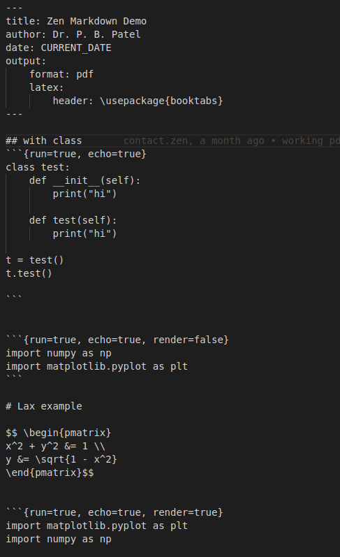
### Output
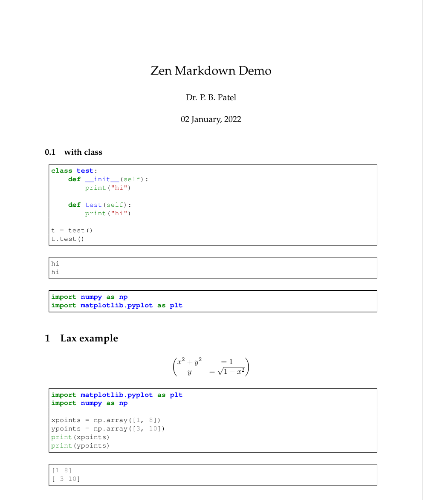

## PDF example with SQL
### py example
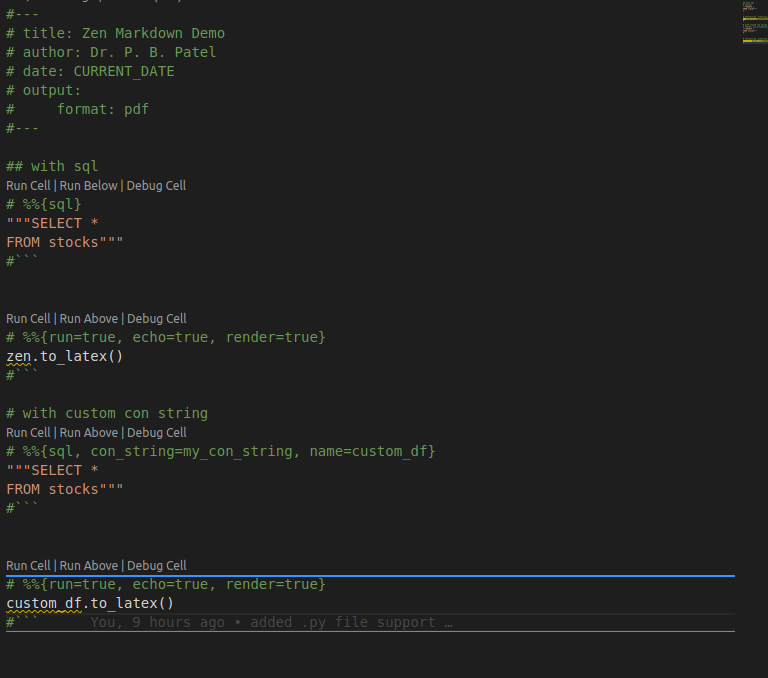 
### pyz example
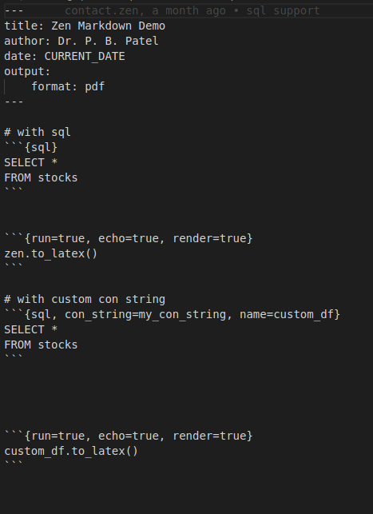 
### Output
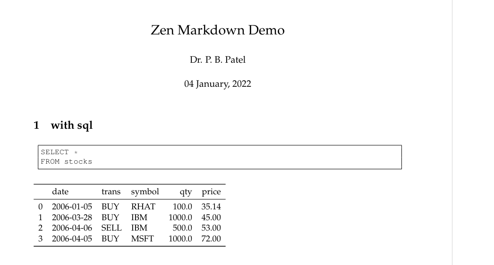 

## HTML example
### py example
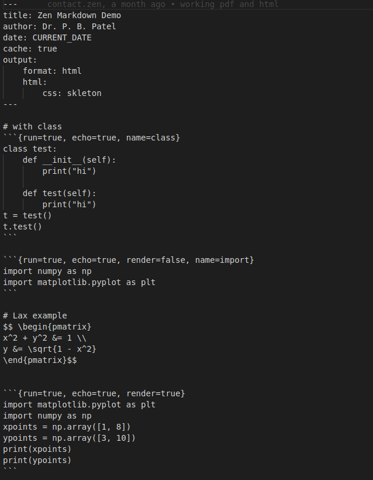 
### pyz example
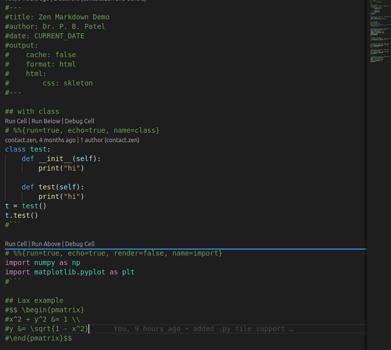 
### Output
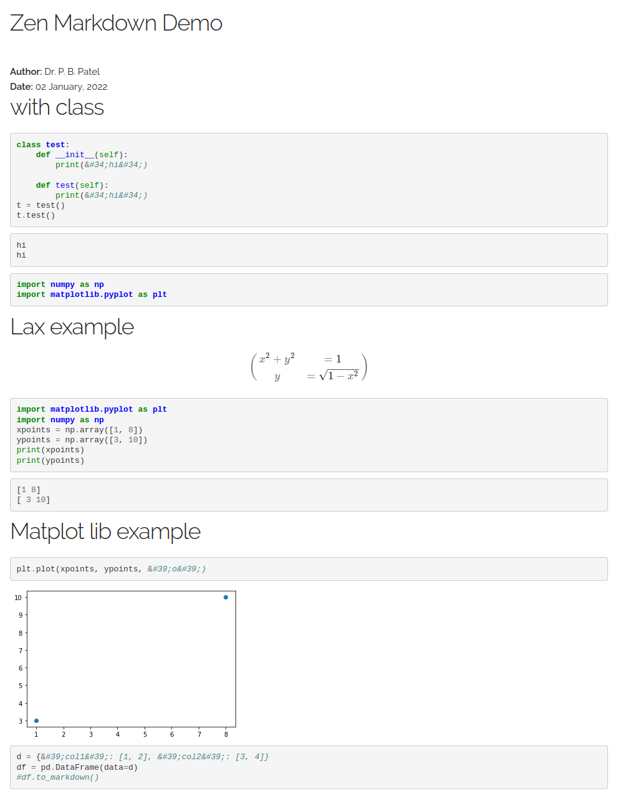
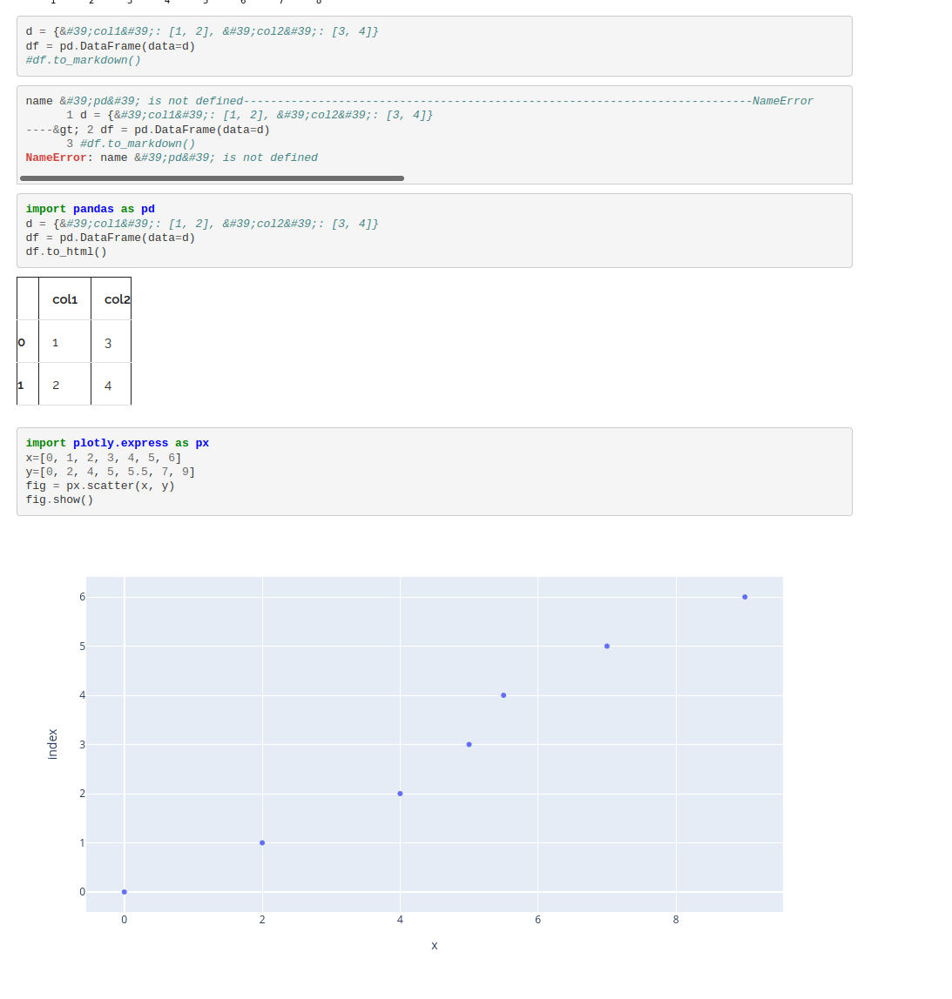

## HTML example with custom CSS
### py example
#### https example
 
#### local css example
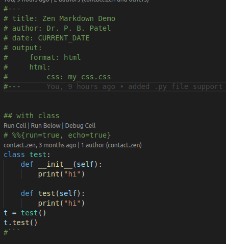
### pyz example
#### https example

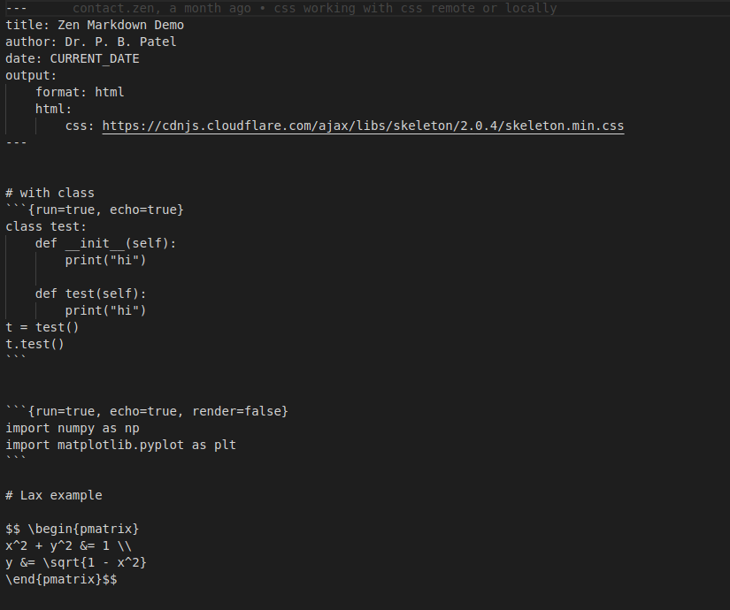 
#### local css example
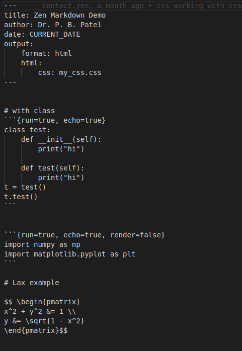

## HTML example with SQL
### py example
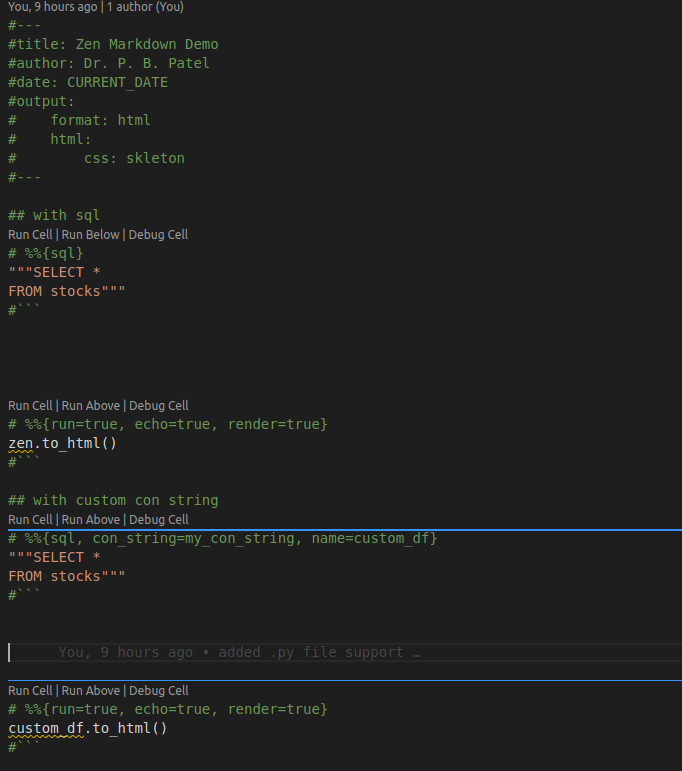 

### pyz example
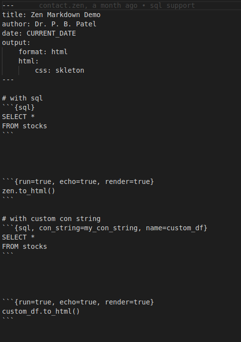 

### Output
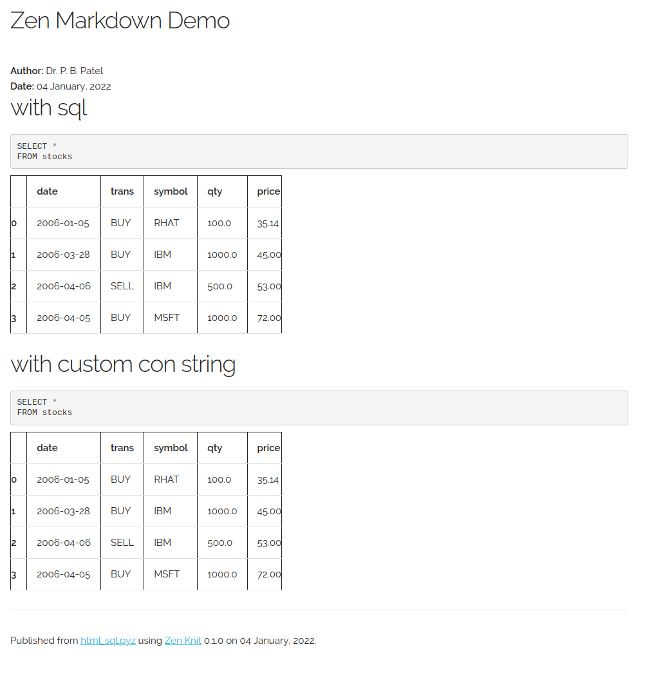 


# Install

From PyPi:

  <code> pip install --upgrade zen-knit </code>

or download the source and run::

  <code> python setup.py install </code>


## Other Dependency

<code> install pandoc from : https://github.com/jgm/pandoc/releases </code>

<code> install texlive for debian: sudo apt install texlive-full </code>

<code> install texlive for window: https://www.tug.org/texlive/acquire-netinstall.html </code>

<code> install texlive for mac: https://tug.org/texlive/quickinstall.html </code>


## License information


Permission is hereby granted, free of charge, to any person obtaining
a copy of this software and associated documentation files (the
"Software"), to deal in the Software without restriction, including
without limitation the rights to use, copy, modify, merge, publish,
distribute, sublicense, and/or sell copies of the Software, and to
permit persons to whom the Software is furnished to do so, subject to
the following conditions:

The above copyright notice and this permission notice shall be
included in all copies or substantial portions of the Software.

THE SOFTWARE IS PROVIDED "AS IS", WITHOUT WARRANTY OF ANY KIND,
EXPRESS OR IMPLIED, INCLUDING BUT NOT LIMITED TO THE WARRANTIES OF
MERCHANTABILITY, FITNESS FOR A PARTICULAR PURPOSE AND
NONINFRINGEMENT. IN NO EVENT SHALL THE AUTHORS OR COPYRIGHT HOLDERS BE
LIABLE FOR ANY CLAIM, DAMAGES OR OTHER LIABILITY, WHETHER IN AN ACTION
OF CONTRACT, TORT OR OTHERWISE, ARISING FROM, OUT OF OR IN CONNECTION
WITH THE SOFTWARE OR THE USE OR OTHER DEALINGS IN THE SOFTWARE.


## How to Use it

  <code> pip install zen-knit  </code>

  <code> knit -f doc/example/html_example.pyz  -ofd doc/example/output/  </code>
  
  <code> knit -f doc/example/pdf_example.pyz  -ofd doc/example/output/  </code>

  <code>  python doc/example/demo.py  </code>
  

## Arguments 
    ---
    title: Zen Markdown Demo
    author: Dr. P. B. Patel
    date: CURRENT_DATE
    output: 
        cache: true
        format: html
        html: 
            css: skleton
    ---

Above code will map on GlobalOption class in in following

    class Input(BaseModel):
        dir: Optional[str]
        file_name: Optional[str]
        matplot: bool = True
    
    class latexOuput(BaseModel):
        header: Optional[str] 
        page_size: Optional[str] = 'a4paper'
        geometry_parameter: Optional[str] = "text={16.5cm,25.2cm},centering"  #Newely added parameters

    class htmlOutput(BaseModel):
        css: str = "bootstrap"

    class Output(BaseModel):
        fig_dir: str = "figures"
        format: Optional[str]
        file_name: Optional[str]
        dir: Optional[str]
        latex: Optional[latexOuput]
        html: Optional[htmlOutput]

    class GlobalOption(BaseModel):
        title: str
        author: Optional[str]
        date: Optional[str]
        kernal: str = "python3"
        log_level: str = "debug"
        cache: Optional[bool] = False
        output: Output
        input: Input

        @validator('log_level')
        def fix_option_for_log(cls, v:str):
            if v.lower() not in ('notset', "debug", 'info', 'warning', 'error', 'critical'):
                raise ValueError('must contain a space')
            return v.title()


# Zen Publish:
Ability to publish programmable, formal, informal reports to Private or Public instance of zen reportz.
Learn more at [Here](https://zenreportz.com?utm=github)

Learn more about how to publish to private or public instance of Zen Reportz [Here](https://zenreportz.com/how-to-publish-to-zen-reportz?utm=github)

# analytics-reports.zenreportz.com features
* Static Reports like HTML, PDF
* Any one access reports 
* Free to use 
* Unlimite Publish
* Republish report same place again
