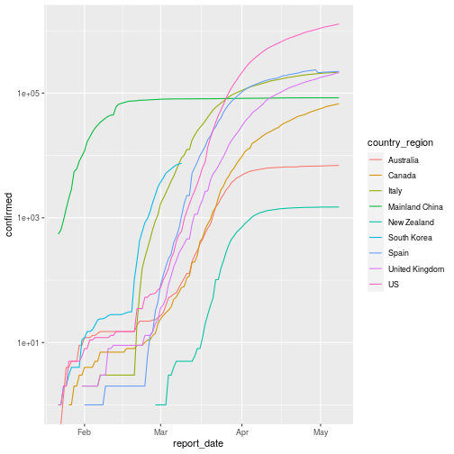
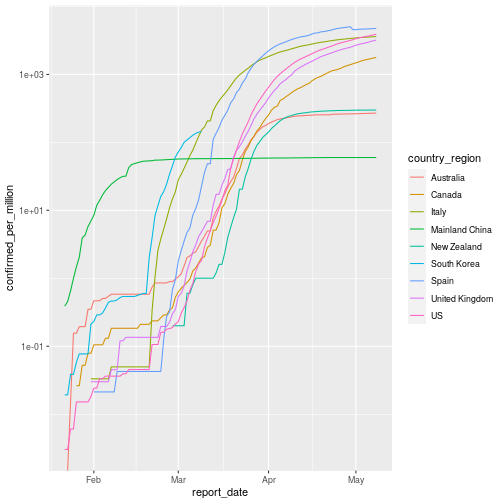

## What is Coroana Virus?
According to webMD
"A coronavirus is a type of common virus that can infect your nose, sinuses, or upper throat. They can spread much like cold viruses. Almost everyone gets a coronavirus infection at least once in their life, most likely as a young child.

Most coronaviruses are not dangerous, but some are. Those that cause Middle East respiratory syndrome (MERS) or severe acute respiratory syndrome (SARS ) can be deadly."

It means most of Corona virus are harmless for most of people. However, new variant of corona virus COVID-19 is deadly. World Health Organization (WHO) has decalaried pandemic due to COVID-19 on 11th March, 2019. Around 38,000 death is attributed to COVID-19 so far.

## What are sysmpotms for COVID-19
According to Center for Disease Control and Prevension (CDC)  following are symptoms of COVID-19

* Fever
* Cough
* Shortness of breath

If you see following  are emergency warning signs for COVID-19. If you developed these symptoms, CDC recommended you to get medical attention immediately.

* Trouble breathing
* Persistent pain or pressure in the chest
* New confusion or inability to arouse
* Bluish lips or face

### Growth of cases by country

We have seen following graph which shows growth of coroanavirus cases in different countries, where y aixs is logarithmic. This is very good graph to show expoenstional growth data. COVID-19 has potensional of expoenstial growth. However, there is one big potential problem using log scale. At large numbers, numbers are close to gather and small numbers are furthur apart. Basically means that we can't compare multiple lines because dinsrance between lines are changing base upon major ticks.

If we using noramal axis, we do see graph as following. In this graph shows that US has lot more cases compare to other counteries. We can't compare US with above graph.

### Growth of cases by country per million population

However, This is not fair way to compare countries to each other. One reason is countries don't have equal size of popluation. Therefore, this graphs is misleading. better way to compare is confirmed cases per million people. This will allow us compare small population countries to big population countries. Following graph suggest that Spain has lot more casese per million people than any other country. US is second place.

### Growth of cases by country per million population (log axis)

However, normalizing by population is still not good way to compare two contries. For example, as we know this virus spreads much faster in denser communities than sparse community. If two contries who has same population but density is different, then they will have much different profile. So we want to normalized by density to comparse all contries properly. This normalization shows US is far mroe covid 19 after normalization of density. Because of this we have hard to compare other countries. To see other contires for comparision. We need to convert y axis in log scale.

### Growth of cases by country normalized by density

### Growth of cases by country normalized by density (log axis)

This graph suggest, from given contries, only New Zeland is success stories. Where US has failed to control covid-19.

However, normazliation by density is not perfect metrics as any other metrics either. Austrilia and Canada is outliears where majority of pouplation lives in small area. So their density is low, howere, in practical, they are densier than atual density. Which takes to second point It is hard to compare different countires because different coutnries have different population density in different place. Since countires are not homogiouns , it is not good comparision. However, if you compare cities or state, which have closer population density function (not population density) then it will be much better comparision.

## Summary:
No matter how we are comparing different countries, we do see US is struggling with corona virus. China's number doesn't seems to accurate
